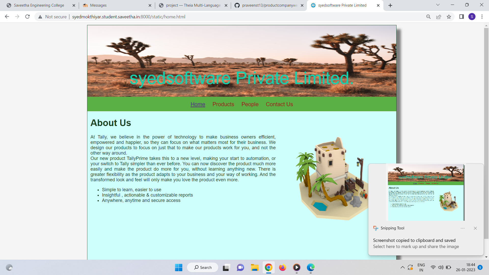
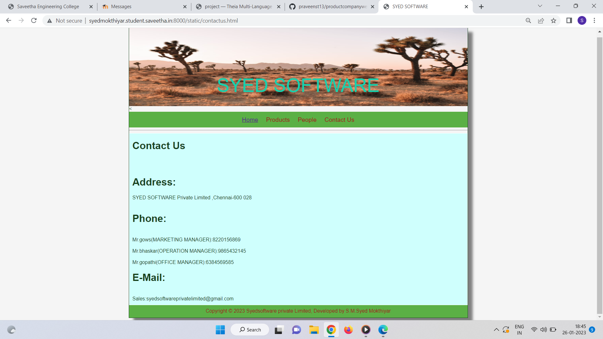
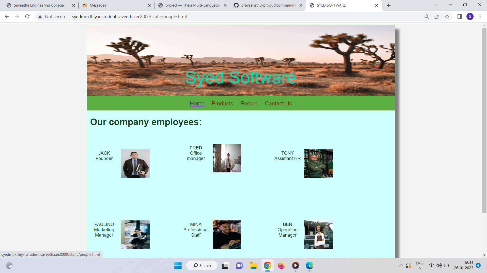
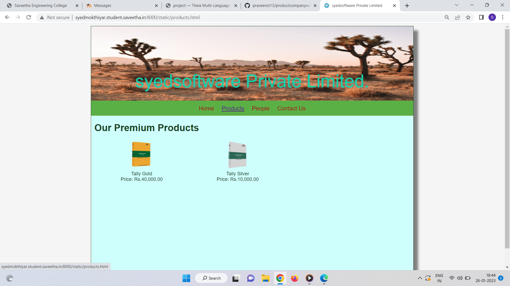

# Web Design for a Software Product Company

## AIM:

To design a static website for a software product company company.

## DESIGN STEPS:

### Step 1:

Requirement collection.

### Step 2:

Creating the layout using HTML and CSS.

### Step 3:

Updating the sample content.

### Step 4:

Choose the appropriate style and color scheme.

### Step 5:

Validate the layout in various browsers.

### Step 6:

Validate the HTML code.

### Step 6:

Publish the website in the given URL.

## PROGRAM :
Home.html:
```
<!DOCTYPE html>
<html lang="en">
  <head>
    <title>syedsoftware Private Limited</title>
    <link rel="stylesheet" href="./css/layout.css" />
    <link rel="icon" href="./img/icon.png" type="image/x-icon" />
  </head>

  <body>
    <div class="container">
      <div class="banner">syedsoftware Private Limited.</div>
      <div class="menu">
        <div class="menuitemselected"><a href="/static/home.html">Home</a></div>
        <div class="menuitem"><a href="/static/products.html">Products</a></div>
        <div class="menuitem"><a href="people.html">People</a ></div>
        <div class="menuitem"><a href="contactus.html" >Contact Us</a ></div>
      </div>
      <div class="content">
        <div class="homecontent">
          <h1>About Us</h1>
          
          <div class="contenttext">
            At Tally, we believe in the power of technology to make business
            owners efficient, empowered and happier, so they can focus on what
            matters most for their business. We design our products to focus on
            just that to make our products work for you, and not the other way
            around.
            <br />
            Our new product TallyPrime takes this to a new level, making your
            start to automation, or your switch to Tally simpler than ever
            before. You can now discover the product much more easily and make
            the product do more for you, without learning anything new. There is
            greater flexibility as the product adapts to your business and your
            way of working. And the transformed look and feel will only make you
            love the product even more.
            <ul>
              <li>Simple to learn, easier to use</li>
              <li>Insightful , actionable & customizable reports</li>
              <li>Anywhere, anytime and secure access</li>
            </ul>
          </div>
        </div>
      </div>
      <div class="footer">
        Copyright &#169; 2021 syedsoftware Private Limited, Developed by S.M.Syed Mokthiyar
      </div>
    </div>
  </body>
</html>

```
contactus.html:
```
<!DOCTYPE html>
<html lang="en">
  <head>
    <title>SYED SOFTWARE</title>
     <link rel="stylesheet" type="text/css" href="./css/layout.css">
  </head>
  <body>
    <div class="container">
      <div class="banner">SYED SOFTWARE</div>
      < <div class="menu">
        <div class="menuitemselected"><a href="/static/home.html">Home</a></div>
        <div class="menuitem"><a href="/static/products.html">Products</a></div>
        <div class="menuitem"><a href="people.html">People</a ></div>
        <div class="menuitem"><a href="contactus.html" >Contact Us</a ></div>
      </div>
      <hr>
      <div class="content">
        <div class="homecontent">
          <h1>Contact Us</h1><br><br>
          <h1>Address:</h1>
          <div class="contenttext">
            SYED SOFTWARE Private Limited ,Chennai-600 028
          </div><br>
          <h1>Phone:</h1><br>
          <div class="contenttext">
              Mr.gows(MARKETING MANAGER):8220156869<br><br>
              Mr.bhaskar(OPERATION MANAGER):9865432145<br><br>
              Mr.gopathi(OFFICE MANAGER):6384569585
          </div>
          <h1>E-Mail:</h1><br>
          <div class="contenttext">
              Sales:syedsoftwareprivatelimited@gmail.com
          </div>
        </div>
      </div>
      <div class="footer">
        Copyright &#169; 2023 Syedsoftware private Limited, Developed by S.M.Syed Mokthiyar
      </div>
    </div>
  </body>
</html>
```
People.html:
```
<!DOCTYPE html>
<html lang="en">
  <head>
    <title>SYED SOFTWARE</title>
    <link rel="stylesheet" type="text/css" href="./css/layout.css">
   
    </head>
    <body>
    <div class="container">
      <div class="banner">Syed Software</div>
      <div class="menu">
        <div class="menuitemselected"><a href="/static/home.html">Home</a></div>
        <div class="menuitem"><a href="/static/products.html">Products</a></div>
        <div class="menuitem"><a href="people.html">People</a ></div>
        <div class="menuitem"><a href="contactus.html" >Contact Us</a ></div>
      </div>
      <div class="content">
        <div class="homecontent">
          <h1>Our company employees:</h1><br><br>
          <div class="productitems">
            <div class="productitem"> 
                <div class="itemimage">
                
                </div>
                <div class="itemname">JACK</div>
                <div class="itemprice">Founder</div>
            </div>
            <div class="productitem"> 
                <div class="itemimage">
                
                </div>
                <div class="itemname">FRED</div>
                <div class="itemprice">Office manager</div>
            </div>
            <div class="productitem"> 
              <div class="itemimage">
              
              </div>
              <div class="itemname">TONY</div>
              <div class="itemprice">Assistant HR</div>
            </div>
            <div class="productitem"> 
              <div class="itemimage">
              
              </div>
              <div class="itemname">PAULINO</div>
              <div class="itemprice">Marketing Manager</div>
          </div>
          <div class="productitem"> 
            <div class="itemimage">
            
            </div>
            <div class="itemname">MINA</div>
            <div class="itemprice">Professional Staff</div>
        </div>  <div class="productitem"> 
          <div class="itemimage">
          
          </div>
          <div class="itemname">BEN</div>
          <div class="itemprice">Operation Manager</div>
      </div>
          </div>
        </div>
        </div>        
    </div>
    <div class="footer">
      Copyright &#169; 2023 syedsoftware Private Limited, Developed by S.M.syed mokthiyar
    </div>
  </div>
</body>
</html>
```
Product.html
```
<!DOCTYPE html>
<html lang="en">
  <head>
    <title>syedsoftware Private Limited</title>
    <link rel="stylesheet" href="./css/layout.css" />
    <link rel="icon" href="./img/icon.png" type="image/x-icon" />
  </head>

  <body>
    <div class="container">
      <div class="banner">syedsoftware Private Limited.</div>
      <div class="menu">
        <div class="menuitem"><a href="/static/home.html">Home</a></div>
        <div class="menuitemselected">
          <a href="/static/products.html">Products</a>
        </div>
    <div class="menuitem"><a href="people.html">People</a ></div>
        <div class="menuitem"><a href="contactus.html" >Contact Us</a ></div>
      </div>
      <div class="content">
        <div class="productcontent">    
          <h1>Our Premium Products</h1>
          <div class="productitems">
              <div class="productitem"> 
                  <div class="itemimage">
                  
                  </div>
                  <div class="itemname">Tally Gold</div>
                  <div class="itemprice">Price: Rs.40,000.00 </div>
              </div>
              <div class="productitem"> 
                  <div class="itemimage">
                  
                  </div>
                  <div class="itemname">Tally Silver</div>
                  <div class="itemprice">Price: Rs.10,000.00 </div>
              </div>
          </div>
          </div>        
      </div>
      <div class="footer">
        Copyright &#169; 2021 syedsoftware Private Limited, Developed by S.M.syed mokthiyar.
      </div>
    </div>
  </body>
</html>

```
## OUTPUT:
### Home Page:

### Contact Page:

### People:

### Product :

## Result:

Thus a website is designed for the software product company and the HTML,CSS code are validated.
